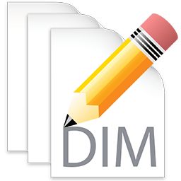
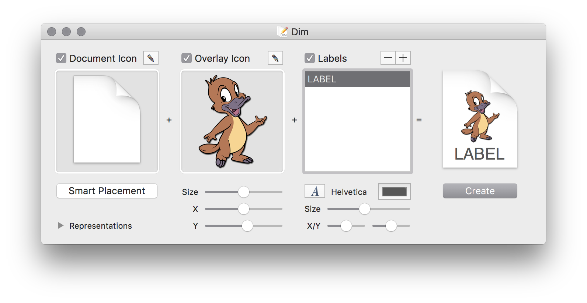

# Dim - Document Icon Maker for OS X



**Dim** is a an app that creates high quality document icons for OS X applications.  It allows for a great deal of customization, supports batch labeling, and generates crisp, good-looking document icons in all sizes. A command line tool counterpart, `dim` is also provided for scripting and automation purposes.

Dim is free, open source software distributed under a three-clause BSD license (see below).

**March 2016: Dim is currently a work in progress and does not yet function as expected**

<!--## Download

* [Download Dim 1.0](http://sveinbjorn.org/files/software/dim.zip) (~0.5 MB, Intel 64-bit only)

-->
 
## Requirements

* Intel 64-bit Mac
* OS X 10.8 or later

## Screenshots



<!--## Version history

###XX/XX/2016 - Version 1.0-->

## BSD License 

````
Copyright (C) 2016 Sveinbjorn Thordarson <sveinbjornt@gmail.com>

Redistribution and use in source and binary forms, with or without modification,
are permitted provided that the following conditions are met:

1. Redistributions of source code must retain the above copyright notice, this
list of conditions and the following disclaimer.

2. Redistributions in binary form must reproduce the above copyright notice, this
list of conditions and the following disclaimer in the documentation and/or other
materials provided with the distribution.

3. Neither the name of the copyright holder nor the names of its contributors may
be used to endorse or promote products derived from this software without specific
prior written permission.

THIS SOFTWARE IS PROVIDED BY THE COPYRIGHT HOLDERS AND CONTRIBUTORS "AS IS" AND
ANY EXPRESS OR IMPLIED WARRANTIES, INCLUDING, BUT NOT LIMITED TO, THE IMPLIED
WARRANTIES OF MERCHANTABILITY AND FITNESS FOR A PARTICULAR PURPOSE ARE DISCLAIMED.
IN NO EVENT SHALL THE COPYRIGHT HOLDER OR CONTRIBUTORS BE LIABLE FOR ANY DIRECT,
INDIRECT, INCIDENTAL, SPECIAL, EXEMPLARY, OR CONSEQUENTIAL DAMAGES (INCLUDING, BUT
NOT LIMITED TO, PROCUREMENT OF SUBSTITUTE GOODS OR SERVICES; LOSS OF USE, DATA, OR
PROFITS; OR BUSINESS INTERRUPTION) HOWEVER CAUSED AND ON ANY THEORY OF LIABILITY,
WHETHER IN CONTRACT, STRICT LIABILITY, OR TORT (INCLUDING NEGLIGENCE OR OTHERWISE)
ARISING IN ANY WAY OUT OF THE USE OF THIS SOFTWARE, EVEN IF ADVISED OF THE
POSSIBILITY OF SUCH DAMAGE.
````